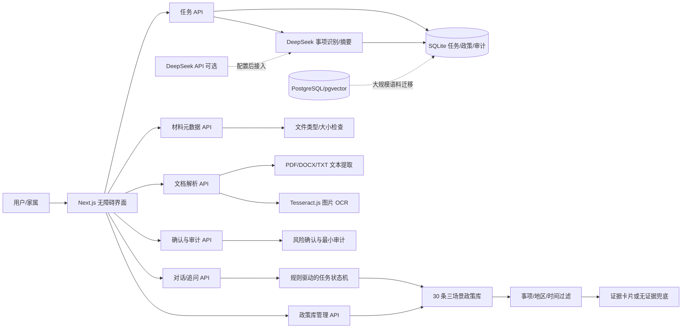

# Smart AI 架构图

```mermaid
flowchart LR
  U[用户/家属] --> UI[Next.js 无障碍界面]
  UI --> T[任务 API]
  UI --> C[对话/追问 API]
  UI --> D[材料元数据 API]
  UI --> P[文档解析 API]
  UI --> A[确认与审计 API]
  UI --> K[政策库管理 API]

  T --> AI[DeepSeek 事项识别/摘要]
  T --> S[(SQLite 任务/政策/审计)]
  AI --> S
  C --> W[规则驱动的任务状态机]
  W --> R[30 条三场景政策库]
  R --> F[事项/地区/时间过滤]
  F --> E[证据卡片或无证据兜底]

  D --> M[文件类型/大小检查]
  P --> X[PDF/DOCX/TXT 文本提取]
  P --> O[Tesseract.js 图片 OCR]
  A --> H[风险确认与最小审计]
  K --> R

  LLM[DeepSeek API 可选] -. 配置后接入 .-> AI
  PG[(PostgreSQL/pgvector)] -. 大规模语料迁移 .-> S
```

当前运行路径使用 SQLite 持久化、DeepSeek（可选）和 Tesseract.js 图片 OCR；扫描版 PDF 逐页 OCR、PostgreSQL/pgvector 和真实政务接口属于后续扩展。
