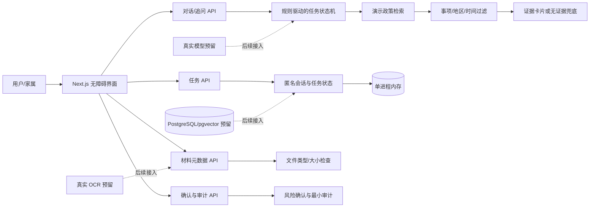

# Smart AI 架构图

```mermaid
flowchart LR
  U[用户/家属] --> UI[Next.js 无障碍界面]
  UI --> T[任务 API]
  UI --> C[对话/追问 API]
  UI --> D[材料元数据 API]
  UI --> A[确认与审计 API]
  T --> S[匿名会话与任务状态]
  C --> W[规则驱动的任务状态机]
  W --> R[演示政策检索]
  R --> F[事项/地区/时间过滤]
  F --> E[证据卡片或无证据兜底]
  D --> M[文件类型/大小检查]
  A --> H[风险确认与最小审计]
  S --> P[(单进程内存)]
  DB[(PostgreSQL/pgvector 预留)] -. 后续接入 .-> S
  OCR[真实 OCR 预留] -. 后续接入 .-> D
  LLM[真实模型预留] -. 后续接入 .-> W
```

当前实现不含真实 LLM、OCR 或持久数据库。
